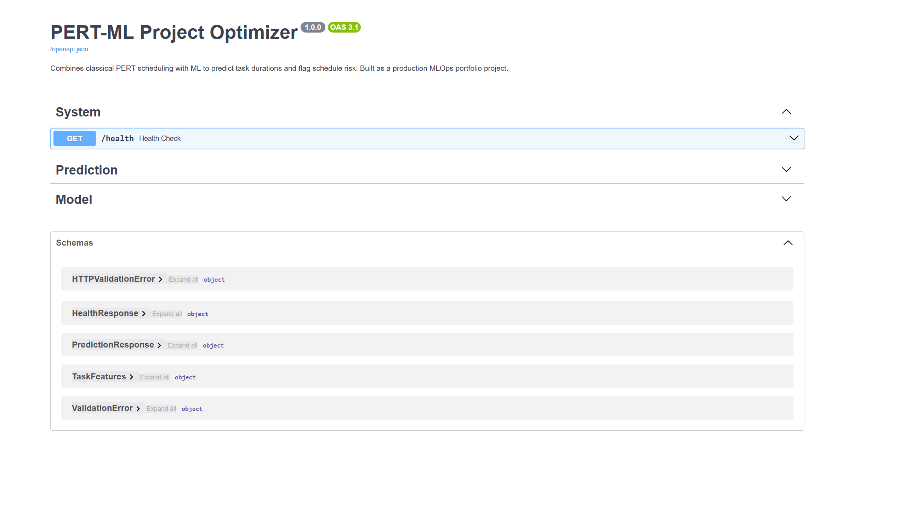
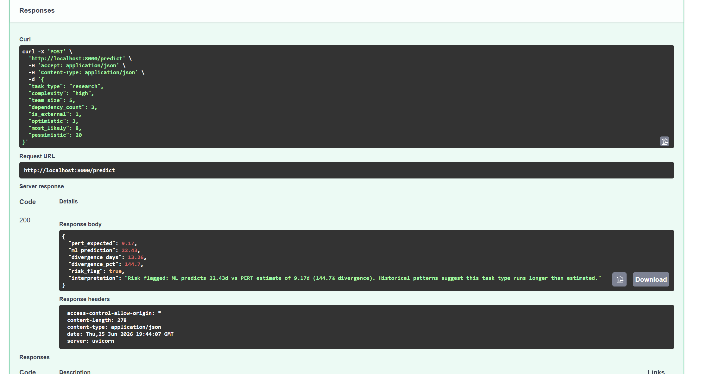

# PERT-ML Project Optimizer

A production-ready tool that combines classical PERT (Program Evaluation and Review Technique) scheduling with machine learning to predict project task durations, identify bottlenecks, and flag schedule risk before it becomes schedule failure.

---

## Problem

Project managers estimate task durations using intuition, historical analogy, or three-point PERT estimates. These methods ignore the structured patterns in historical project data — patterns that machine learning can exploit to make estimates more accurate and risk more visible.

This tool closes that gap: take historical project data, learn from it, and surface probabilistic schedule risk in real time through a deployable API.

---

## Live Demo

### API Documentation


### Prediction Response — High Risk Task


> A research task with high complexity, 3 dependencies, and external involvement.
> PERT estimated 9.17 days. ML predicted 22.43 days — a 144.7% divergence.
> Risk flagged before the work began.

---

## Architecture

---

## Model Performance

| Metric | Value |
|--------|-------|
| MAE | 0.986 days |
| RMSE | 1.398 days |
| R² | 0.886 |
| Training samples | 800 |

---

## Drift Monitoring Results

Running Evidently AI against simulated production data:

- **Drifted features:** 3/7 (42.9%)
- **Features drifted:** team_size, pessimistic, pert_expected
- **Dataset drift detected:** False
- **Model status:** Valid — drift within acceptable range

In production, this report runs on a schedule. Drift above threshold triggers automated retraining.

---

## What It Does

**PERT Engine** computes the classic three-point estimate:
- Expected duration: `(O + 4M + P) / 6`
- Variance: `((P - O) / 6)²`
- Critical path identification across task dependencies

**ML Layer** learns from historical task features to predict actual completion time:
- Task type, team size, complexity rating, dependency count
- Compares predicted vs. PERT estimate to surface systematic bias
- Flags tasks where ML and PERT diverge significantly (schedule risk signal)

**FastAPI Service** exposes both engines through a single endpoint:
- Input: task features JSON
- Output: PERT estimate, ML prediction, risk score, confidence interval

**Monitoring Layer** tracks incoming request distributions against training data:
- Detects feature drift using Evidently AI
- Generates HTML drift reports on demand
- Designed to trigger retraining pipelines in production

---

## Tradeoffs & Design Decisions

**Why XGBoost over a neural network?**
Tabular project data is small and structured — tree-based models consistently outperform deep learning here. XGBoost also produces feature importances natively, which is more useful for a project management audience than a black-box prediction.

**Why keep PERT at all?**
PERT estimates are explainable and trusted by project managers. The ML layer augments rather than replaces — when the two agree, confidence is high; when they diverge, that divergence is itself a signal worth surfacing.

**Why a 20% divergence threshold for risk flagging?**
Tunable based on organizational risk tolerance. Lower threshold = more flags, higher sensitivity. Higher threshold = fewer flags, higher specificity. In production this would be calibrated against historical false positive rates.

**What would change at 10x scale?**
- Replace CSV input with a feature store (Feast or Tecton)
- Move drift detection to a streaming pipeline (Kafka + Flink)
- Add A/B testing layer to compare model versions before full rollout
- Containerize with Docker Compose, deploy to AWS ECS or Kubernetes
- Add authentication layer to the API

---

## Quickstart

```bash
# Clone the repo
git clone https://github.com/anthonysirico26/pert-ml-optimizer.git
cd pert-ml-optimizer

# Create and activate virtual environment
python3 -m venv .venv
source .venv/bin/activate

# Install dependencies
pip install -r requirements.txt

# Generate synthetic training data
python data/generate_data.py

# Train the ML model
python models/train.py

# Start the API
uvicorn api.main:app --reload

# Run drift report
python monitoring/drift_report.py
```

Visit `http://localhost:8000/docs` for the interactive API documentation.

---

## Run Tests

```bash
pytest tests/ -v
```

7 tests covering PERT calculations, critical path logic, and edge cases.

---

## Project Structure

---

## Author

Anthony Sirico, Ph.D. — AI/ML Engineering Leader | Naval CTO | Palantir ATF Fellow
[LinkedIn](https://www.linkedin.com/in/anthony-sirico-ph-d-b2620989/) · [GitHub](https://github.com/anthonysirico26)

*Built as part of a deliberate transition toward Director-level AI/ML engineering and decision science leadership.*